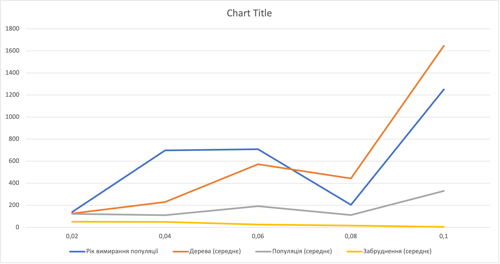
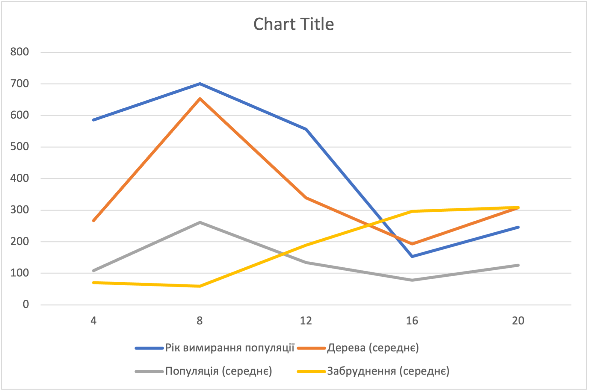
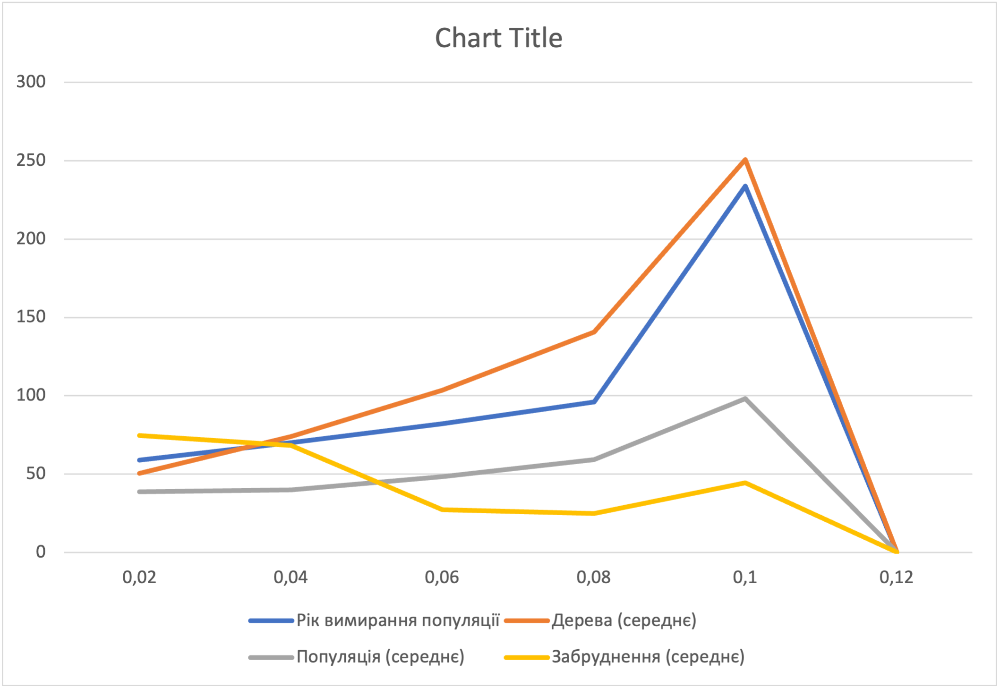

## Комп'ютерні системи імітаційного моделювання
## СПм-22-6, **Пунченко Поліна Вячеславівна**
### Лабораторна робота №**1**. Опис імітаційних моделей та проведення обчислювальних експериментів

 

### Варіант 4, модель у середовищі NetLogo:
[Urban Suite - Pollution](http://www.netlogoweb.org/launch#http://www.netlogoweb.org/assets/modelslib/Curricular%20Models/Urban%20Suite/Urban%20Suite%20-%20Pollution.nlogo)

 

### Вербальний опис моделі:
Модель "Urban Suite - Pollution" є дослідженням вразливої рівноваги екосистеми хижак-жертва. У закритому середовищі конкурують популяції людей, ландшафтних елементів та зграї аерозольних забруднюючих агентів за ресурси. 
Модель дозволяє вивчати динаміку популяцій та спостерігати за регулярними чи нерегулярними циклами їхнього розмноження протягом часу. Регулярні - вказують на стабільність в екосистемі, де популяції зберігаються з часом. Нерегулярні - свідчать про нестабільність і можуть призвести до потенційного вимирання обох взаємозалежних популяцій. Модель встановлює негативний зворотний зв'язок: хижаки гальмують щільність жертв, а жертви стимулюють щільність хижаків.

### Керуючі параметри:
- **initial-population** Початкова кількість населення у місті: контролює кількість людей, створених на початку запуску моделі.
- **birth-rate** Швидкість приросту населення міста: контролює ймовірність кожної людини створити потомство протягом певного періоду.
- **planting-rate** Швидкість посадки дерев для зменшення забруднення: контролює ймовірність, що людина буде садити дерево щорічно.
- **power-plants** Початкова кількість електростанцій у місті: контролює кількість електростанцій, створених на початку запуску моделі.
- **polluting-rate** Забруднення, яке виділяє кожна електростанція за рік: поширюється на навколишню територію і визначає його вплив на здоров'я людей

### Внутрішні параметри:
- **people** Кількість населення в місті.
- **trees** Кількість дерев у місті.
- **pollution** Рівень забруднення в екосистемі.

### Показники роботи системи:
- **Динаміка висадження дерев** Оцінка кількості нових дерев, які були посаджені, відображаючи зусилля у напрямку покращення екосистеми.
- **Зміни в чисельності населення** Визначення тенденцій у розмірі населення, що дозволяє відслідковувати вплив інших факторів на динаміку населення міста.
- **Рівень забруднення** Оцінка впливу електростанцій на рівень забруднення повітря, спрощуючи аналіз його впливу на навколишнє середовище.

### Примітки:
При налаштуваннях керуючих параметрів за замовчуванням, популяції зазнають вимирання, проте тривалість їхнього існування має значні варіації.

### Недоліки моделі:
- Не враховує появу технологій та інновацій, які можуть впливати на забруднення.
- Модель не бере до уваги географічні особливості, які можуть впливати на поширення забруднення та інші аспекти екосистеми.

 

## Обчислювальні експерименти
### 1. Вплив швидкості посадки дерев на динаміку популяції
Досліджується вплив кількості дерев на динаміку популяції в екосистемі. Визначається, як змінюється рівень забруднення при зміні кількості дерев. Експерименти проводяться при 0.02-0.1 швидкості посадки дерев, з кроком 0.02, усього 5 симуляцій.
Інші керуючі параметри мають значення за замовчуванням:
- **initial-population**: 30;
- **birth-rate**: 0,1;
- **power-plants**: 2;
- **polluting-rate**: 3.
<table>
<thead>
<tr><th>Швидкість висадження дерев</th><th>Рік вимирання популяції</th><th>Дерева (середнє)</th><th>Популяція (середнє)</th><th>Забруднення (середнє)</th></tr>
</thead>
<tbody>
<tr><td>0,02</td><td>139</td><td>124,91</td><td>122,3</td><td>50,70</td></tr>
<tr><td>0,04</td><td>698</td><td>229,8</td><td>110,95</td><td>49,75</td></tr>
<tr><td>0,06</td><td>708</td><td>571,83</td><td>191,92</td><td>25,64</td></tr>
<tr><td>0,08</td><td>204</td><td>443,92</td><td>112,16</td><td>16,55</td></tr>
<tr><td>0,1</td><td>1250</td><td>1645,57</td><td>330,18</td><td>4,58</td></tr>
</tbody>
</table>

Висновки: 
1. Рік вимирання популяції збільшується зі збільшенням швидкості висадження дерев.
2. Максимальна кількість дерев спостерігається при найвищій швидкості висадження (0,1), що демонструє ефективність стратегії активного зеленого будівництва.
3. Зі збільшенням швидкості висадження дерев популяція також збільшується, вказуючи на позитивний ефект дерев на збереження життєздатності популяції.
4. Забруднення зменшується разом із зростанням швидкості висадження дерев, що свідчить про ефективність дерев у зменшенні рівня забруднення.

### 2. Вплив кількісті електростанцій на динаміку популяції
Досліджується, як зміна кількісті електростанцій впливає на динаміку популяції в екосистемі. Експерименти проводяться при 4-20 електростанцій, з кроком 4, усього 5 симуляцій.
Інші керуючі параметри мають значення за замовчуванням:
- **initial-population**: 30;
- **birth-rate**: 0,1;
- **planting-rate**: 0,05;
- **polluting-rate**: 3.
<table>
<thead>
<tr><th>Кількість електростанцій</th><th>Рік вимирання популяції</th><th>Дерева (середнє)</th><th>Популяція (середнє)</th><th>Забруднення (середнє)</th></tr>
</thead>
<tbody>
<tr><td>4</td><td>586</td><td>266,65</td><td>108,51</td><td>69,99</td></tr>
<tr><td>8</td><td>700</td><td>652,80</td><td>261,34</td><td>58,83</td></tr>
<tr><td>12</td><td>556</td><td>338,68</td><td>133,98</td><td>189,46</td></tr>
<tr><td>16</td><td>153</td><td>193,03</td><td>78,37</td><td>295,85</td></tr>
<tr><td>20</td><td>246</td><td>307,76</td><td>125,52</td><td>308,83</td></tr>
</tbody>
</table>

Висновки: 
1. Рік вимирання популяції зменшується зі збільшенням кількості електростанцій.
2. Максимальна кількість дерев спостерігається при кількості електростанцій 8, але з подальшим зростанням кількості станцій, кількість дерев зменшується.
3. Зі збільшенням кількості електростанцій популяція зменшується.
4. Забруднення збільшується разом із зростанням кількості електростанцій.

### 3. Вплив швидкісті приросту населення на динаміку популяції
Досліджується, як зміна швидкісті приросту населення впливає на динаміку популяції в екосистемі. Експерименти проводяться при 0.02-0.12, з кроком 0.02, усього 6 симуляцій.
Інші керуючі параметри мають значення за замовчуванням:
- **initial-population**: 30;
- **power-plants**: 2;
- **planting-rate**: 0,05;
- **polluting-rate**: 3.
<table>
<thead>
<tr><th>Швидкість приросту населення</th><th>Рік вимирання популяції</th><th>Дерева (середнє)</th><th>Популяція (середнє)</th><th>Забруднення (середнє)</th></tr>
</thead>
<tbody>
<tr><td>0,02</td><td>59</td><td>50,48</td><td>38,83</td><td>74,64</td></tr>
<tr><td>0,04</td><td>70</td><td>73,85</td><td>39,79</td><td>68,27</td></tr>
<tr><td>0,06</td><td>82</td><td>103,42</td><td>48,22</td><td>27,25</td></tr>
<tr><td>0,08</td><td>96</td><td>140,68</td><td>59,10</td><td>24,69</td></tr>
<tr><td>0,1</td><td>234</td><td>250,63</td><td>98,14</td><td>44,28</td></tr>
<tr><td>0,12</td><td>∞</td><td>∞</td><td>∞</td><td>∞</td></tr>
</tbody>
</table>

Висновки: 
1. Рік вимирання популяції збільшується разом із зростанням швидкості приросту населення, досягаючи нескінченності при швидкості 0,12.
2. Зі збільшенням швидкості приросту населення кількість дерев також збільшується.
3. Популяція збільшується разом із зростанням швидкості приросту населення.
4. Забруднення зменшується разом із зростанням швидкості приросту населення.
